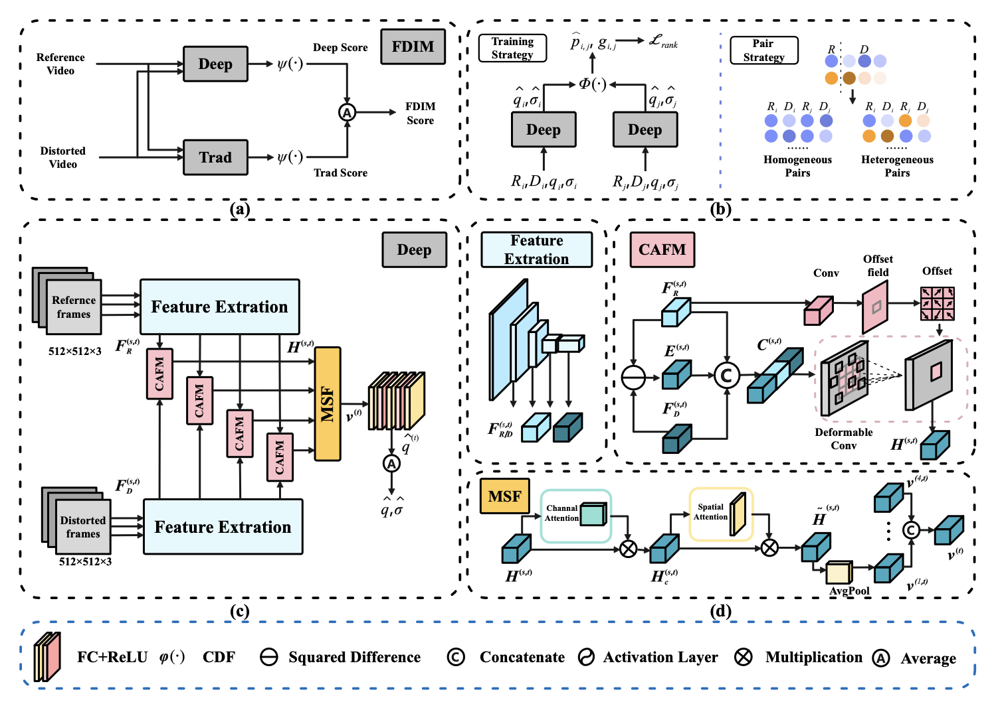
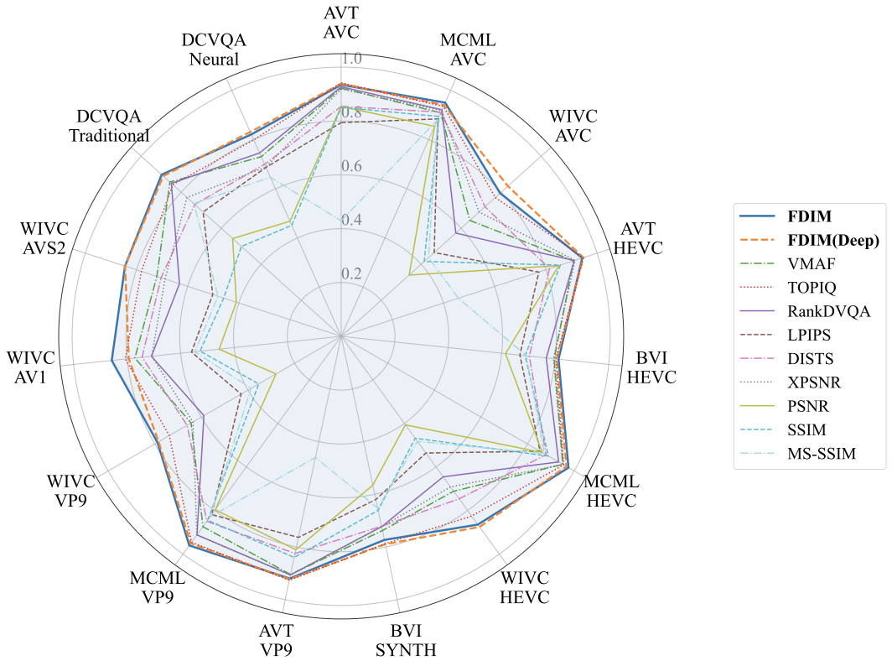
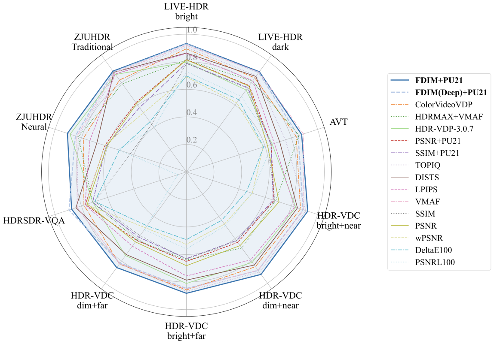
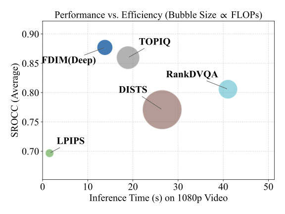

# FDIM

[](https://arxiv.org/abs/2604.24123)

## Introduction

FDIM is a feature-distance-based video quality assessment (VQA) metric designed to generalize across:

- Traditional and neural codecs
- SDR and HDR formats
- Diverse resolutions and content types

FDIM uses a hybrid architecture consisting of:

- **Deep branch**: learns multi-scale representations to capture distortions ranging from low-level fidelity degradation to high-level semantic differences, using a content-adaptive feature comparison mechanism.
- **Hand-crafted branch**: improves robustness and generalization across domains.

FDIM is trained on the large-scale DCVQA dataset (16k+ samples covering both conventional and neural codecs) and delivers strong, consistent performance across multiple public SDR and HDR VQA benchmarks.



<p align="center">
  
  
</p>

<p align="center">
  
</p>

The package supports quality evaluation for either a single compressed video or a collection of compressed videos in YUV or RGB format.

## Citation

If you find this work useful, please cite:

```bibtex
@misc{wang2026fdimfeaturedistancebasedgenericvideo,
  title={FDIM: A Feature-distance-based Generic Video Quality Metric for Versatile Codecs},
  author={Jiayi Wang and Lichun Zhang and Xiaoqi Zhuang and Jiaqi Zhang and Lu Yu and Yin Zhao},
  year={2026},
  eprint={2604.24123},
  archivePrefix={arXiv},
  primaryClass={cs.CV},
  url={https://arxiv.org/abs/2604.24123}
}
```

## Installation

### Prerequisite

* [verified] CUDA 12.2
* python 3.9
* ffmpeg in PATH

### Setup Virtualenv

```
conda create -n fdim python=3.9.20
conda activate fdim
```

### Install packages for inference

Run the following command from the repository root:

```
pip install -e .
```

You can also use:

```
bash install.sh
```

Note: `install.sh` will create and activate a `conda` environment named `fdim` automatically. If you already created and activated the environment manually, prefer `pip install -e .` to avoid duplicated setup.

## Instruction to run FDIM

### 1. Download the chekpoint/model

The default checkpoint path used by the scripts is:

* fdim: put it in `./fdim/dist/checkpoints/`

The current repository uses `./fdim/dist/checkpoints/dist_5.0.0.ckpt` by default. If you want to use another checkpoint, pass it explicitly with `--model_path <path_to_checkpoint>`.

### 2. Prepare video information file

Create a CSV file in `./data/dataset/` and enter the information of all the video you want to evaluate as follow:

| ref_name                         | dis_name                                         | mos         | ref_width | ref_height | dis_width | dis_height | ref_bits | dis_bits |
| -------------------------------- | ------------------------------------------------ | ----------- | --------- | ---------- | --------- | ---------- | -------- | -------- |
| SRC1001_1920x1080_25_yuv420p.mp4 | SRC1001_1920x1080_25_yuv420p.mp4.x265.r0.265.mp4 | 4.854890404 | 1920      | 1080       | 1920      | 1080       | 8        | 8        |

* ref_name: The name of the reference video.
* dis_name: The name of the test video.
* mos: The ground truth of video quality. If unavailable, set it to 0.
* ref_width, ref_height: The video resolution of reference video.
* dis_width, dis_height: The video resolution of distorted video.

If your yuv videos are 8bit, you don't need the "ref_bits" and "dis_bits" columns.

### 3. Inference

#### Evaluate the quality of all videos in a dataset

   Add the execute permission.

    chmod +x ./fdim/vmaf/vmaf

1. If the reference video and distorted video is not in YUV format.

   ```
   python dataset_test.py \
       --metric fdim \
       --save_dir ./data/result \
       --save_name fdim_test \
       --ref_dir <path_to_reference_video_dir> \
       --dis_dir <path_to_distorted_video_dir> \
       --csv_path <path_to_csv_file> \
       --ref_fmt rgb \
       --dis_fmt rgb \
       --preprocess none \
       --video_temp_path ./data/video_temp/ \
       --gpu_idx 0
   ```
2. If the reference video is in YUV format, `--ref_width_column` ,  `--ref_height_column` and `--ref_fmt` must be provided, if bit_depth is not 8,`--ref_bit_depth_column` must be provided.

   If the distorted video is in YUV format, `-dis_width_column` ,  `--dis_height_column` and `--dis_fmt` must be provided, if bit_depth is not 8,`--dis_bit_depth_column` must be provided.

   ```
   python dataset_test.py \
       --metric fdim \
       --save_dir data/result \
       --save_name fdim_eem_sample \
       --csv_path <path_to_csv_file> \
       --ref_dir <path_to_reference_video_dir> \
       --dis_dir  <path_to_distorted_video_dir> \
       --ref_column <reference video name column in csv file> \
       --dis_column <distorted video name column in csv file> \
       --ref_fmt <reference video format column in csv file> \
       --dis_fmt <distorted video format column in csv file> \
       --ref_width_column <reference video width column in csv file> \
       --ref_height_column <reference video height column in csv file> \
       --dis_width_column <distorted video width column in csv file> \
       --dis_height_column <distorted video height column in csv file> \
       --ref_bit_depth_column <reference video bitdepth column in csv file> \
       --dis_bit_depth_column <distorted video bitdepth column in csv file> \
       --video_temp_path ./data/video_temp/ \
       --gpu_idx 0
   ```

#### Evaluate the quality of a test video

1. If the reference video and distorted video is not in YUV format.

   python single_test.py --metric fdim --ref_video_root <ref_video_path> --dis_video_root <dis_video_path> --video_temp_path ./data/video_temp/ --gpu_idx 0
2. If the reference/distorted video and distorted video is in YUV format.

   ```
   python single_test.py \
       --metric fdim \
       --ref_video_root <ref_video_path> \
       --dis_video_root <dis_video_path> \
       --ref_fmt <reference video format, such as yuv420p, yuv420p10le> \
       --dis_fmt <distorted video format, such as yuv420p, yuv420p10le> \
       --ref_width <reference video width> \
       --ref_height <reference video height> \
       --dis_width <distorted video width> \
       --dis_height <distorted video height> \
       --ref_bit_depth <reference video bitdepth> \
       --dis_bit_depth <distorted video bitdepth> \
       --video_temp_path ./data/video_temp/ \
       --gpu_idx 0
   ```

#### Inference HDR content

For PQ/HLG content, enable PU21 preprocessing (`--preprocess pu21`) and select (or customize) the correct display model (`--display_model <name>`). The available display model definitions are stored in [`fdim/dist/pycvvdp/vvdp_data/display_models.json`](./fdim/dist/pycvvdp/vvdp_data/display_models.json).

If `--display_model` is not provided while `--preprocess pu21` is enabled, the code uses `standard_hdr_pq_tv` by default.

Reference notes:

- `pycvvdp` in this repository is a vendored third-party module adapted from ColorVideoVDP, which provides the display model and video source utilities used by the HDR preprocessing path.
- `PU21` refers to the perceptually uniform HDR encoding proposed in "PU21: A novel perceptually uniform encoding for adapting existing quality metrics for HDR" and is used here through the integrated `pycvvdp` implementation.

Example:

```
python single_test.py \
    --metric fdim \
    --ref_video_root /path/to/ref.mp4 \
    --dis_video_root /path/to/dis.mp4 \
    --preprocess pu21 \
    --display_model standard_hdr_pq_tv \
    --video_temp_path ./data/video_temp/ \
    --gpu_idx 0
```

#### Low-complexity implementation for 4K videos

If your input videos are 4K and you want faster inference, set the resolution parameter `--input_resolution 1080` to downsample frames before the deep model. In our experiments, this significantly improves runtime while only slightly reducing objective-subjective consistency.
